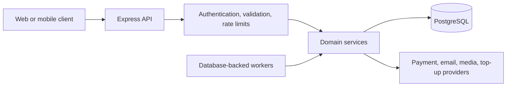

# GameExpress Backend

Production-oriented REST API for a digital commerce platform selling gift cards, game top-ups, and subscription products. The backend is built with Express, TypeScript, Prisma, PostgreSQL, and Redis-compatible rate limiting.

The application keeps pricing, payment verification, inventory allocation, fulfillment, and authorization under server control. Browser redirects and client-supplied payment fields are never treated as proof of payment.

## Contents

- [Architecture](#architecture)
- [Core capabilities](#core-capabilities)
- [Technology](#technology)
- [Getting started](#getting-started)
- [Configuration](#configuration)
- [API documentation](#api-documentation)
- [Authentication](#authentication)
- [Database and migrations](#database-and-migrations)
- [Background processing](#background-processing)
- [Testing and quality checks](#testing-and-quality-checks)
- [Security model](#security-model)
- [Project structure](#project-structure)
- [Render deployment](#render-deployment)
- [Additional documentation](#additional-documentation)

## Architecture

GameExpress is a modular monolith. HTTP concerns stay in routes, middleware, and controllers; domain services own business rules and transactional workflows; Prisma provides the persistence boundary; external integrations are isolated behind provider interfaces.



Payment, order, inventory, delivery, and top-up progress are separate state machines. Critical changes use transactions, row locks, conditional updates, unique identifiers, and idempotency keys to remain safe across retries and concurrent callbacks.

## Core capabilities

- Customer registration, email verification, login, password reset, and profile management.
- Role-based administration for users, products, orders, payments, fulfillment, and audit logs.
- Gift-card catalog, denominations, encrypted inventory, reservation, checkout, and delivery.
- Game catalog, packages, dynamic account fields, top-up orders, queueing, and provider fulfillment.
- Hosted aamarPay checkout with independent server-side transaction verification.
- Customer carts, product reviews, categories, and subscription catalog management.
- Structured and redacted application/request logging.
- In-memory or Redis-backed rate limiting and abuse protection.
- Database-backed reconciliation, retry, delivery, and notification workers.

## Technology

| Area | Technology |
| --- | --- |
| Runtime | Node.js 20+ |
| Language | TypeScript with strict mode |
| HTTP | Express 5 |
| Database | PostgreSQL |
| ORM | Prisma 7 with PostgreSQL adapter |
| Validation | Zod |
| Authentication | JWT in bearer header or HTTP-only cookie |
| Logging | Pino and pino-http |
| Security | Helmet, CORS, HPP, rate limiting, slow-down middleware |
| API documentation | OpenAPI 3.1 and Swagger UI |
| Testing | Node.js test runner and isolated PostgreSQL integration tests |

## Getting started

### Prerequisites

- Node.js 22.12 or newer (Node 22 LTS)
- npm
- PostgreSQL
- Redis is optional for local development

Docker Compose can provide PostgreSQL and Redis:

```bash
docker compose up -d postgres redis
```

### Installation

```bash
npm install
cp .env.example .env
```

Complete the required values in `.env`, then prepare and start the application:

```bash
npx prisma migrate deploy
npm run server:dev
```

The default development server is available at `http://localhost:5000`.

> Existing installations must preserve their current `GIFT_CARD_ENCRYPTION_KEY`. Changing that key makes previously encrypted inventory unreadable.

## Configuration

[`.env.example`](.env.example) is the canonical configuration reference. It contains safe placeholders and documents application, database, authentication, email, payment, gift-card, top-up, worker, and test settings.

Configuration is validated at startup. Invalid ports, URLs, body limits, retry settings, timeouts, or production security settings stop the process before the server accepts requests.

Important variables include:

| Variable | Purpose |
| --- | --- |
| `DATABASE_URL` | PostgreSQL connection URL |
| `JWT_ACCESS_SECRET` | JWT signing secret; use at least 32 random characters in production |
| `CLIENT_URL` | Browser origin allowed by CORS |
| `BACKEND_PUBLIC_URL` | Public callback origin used by the payment gateway |
| `FRONTEND_URL` | Payment-result redirect origin |
| `PAYMENT_PROVIDER` | Active payment provider; `mock` is test-only |
| `AAMARPAY_*` | aamarPay mode, credentials, endpoints, and timeout |
| `GIFT_CARD_ENCRYPTION_KEY` | Base64-encoded 32-byte key for inventory encryption |
| `GAME_TOPUP_PROVIDER` | Active top-up provider implementation |
| `REDIS_URL` | Optional shared rate-limit store |
| `API_DOCS_ENABLED` | Enables Swagger UI and the OpenAPI document |

In production, API documentation is disabled by default unless `API_DOCS_ENABLED=true` is explicitly configured.

## API documentation

Interactive Swagger documentation is available while the server is running:

- Swagger UI: `http://localhost:5000/api-docs`
- OpenAPI JSON: `http://localhost:5000/api-docs.json`

Swagger UI supports request execution, endpoint filtering, request timing, reusable authorization, request schemas, and standardized response/error models.

Validate the OpenAPI document after changing routes or schemas:

```bash
npm run docs:validate
```

To test authenticated endpoints:

1. Call `POST /api/v1/user/login` and allow the browser to retain the HTTP-only cookie; or
2. Select **Authorize** and paste a JWT into `bearerAuth` without the `Bearer` prefix.
3. Choose an endpoint, select **Try it out**, provide its parameters, and execute the request.

The current API is mounted under `/api/v1`. `/api` remains available as a compatibility prefix.

Never enable public production documentation without reviewing whether your deployment should expose its endpoint inventory.

## Authentication

Protected routes accept either:

```http
Authorization: Bearer <access-token>
```

or the HTTP-only `accessToken` cookie set during login. Authorization middleware reloads the user and rejects deleted, disabled, missing, or unauthorized accounts.

Roles currently include customer, admin, and super-admin capabilities. Ownership is checked for customer orders, payments, reviews, and delivery data.

## Database and migrations

Generate the Prisma client:

```bash
npm run prisma:generate
```

Create a development migration after changing the schema:

```bash
npx prisma migrate dev --name describe_the_change
```

Apply committed migrations in an environment:

```bash
npx prisma migrate deploy
```

Validate the Prisma schema:

```bash
npx prisma validate
```

Do not edit migrations that have already been deployed. Payment, inventory, and fulfillment migrations should always be tested against a disposable database before release.

## Background processing

The server starts lightweight scheduler triggers for:

- expired gift-card reservation reconciliation;
- ambiguous payment re-verification;
- gift-card delivery retries;
- game top-up fulfillment retries; and
- top-up email notification retries.

Durable state lives in PostgreSQL. The intervals do not act as the source of truth, so process restarts do not erase pending work.

## Testing and quality checks

```bash
# TypeScript without output
npm run typecheck

# Prisma generation, compilation, and all standard tests
npm test

# Production compilation
npm run build

# OpenAPI structure and reference validation
npm run docs:validate

# Full database-backed commerce and payment suite
npm run test:payment:integration
```

The integration runner creates an isolated PostgreSQL database, runs the workflow tests with mocked external network/email providers, and removes the database afterward. The configured database role must have `CREATEDB` permission.

To validate every checked-in migration instead of using schema push:

```bash
TEST_SCHEMA_MODE=migrate npm run test:payment:integration
```

There is currently no lint script; type checking, builds, Prisma validation, and automated workflow tests are the enforced project checks.

## Security model

- Request payloads are validated and size-limited.
- JWTs are verified server-side and user state is reloaded for protected requests.
- CORS uses explicit origins and credentials-aware handling.
- Helmet supplies HTTP security headers and a restrictive content security policy.
- Public, authentication, payment, upload, customer, and admin traffic have separate rate limits.
- Logs redact authorization headers, cookies, passwords, tokens, OTPs, provider credentials, gift-card codes, and PINs.
- Product prices, payment status, inventory status, and fulfillment state are never accepted as client authority.
- Payment callbacks are independently queried and verified with the gateway before settlement.
- Gift-card values are encrypted at rest and only exposed through authorized fulfillment boundaries.

Swagger has a narrowly scoped CSP override for its own local scripts and styles; the application API retains the stricter global policy.

## Project structure

```text
src/
├── app/                 # API router composition and shared application types
├── config/              # Payment, provider, security, and media configuration
├── docs/                # OpenAPI document and Swagger registration
├── generated/prisma/    # Generated Prisma client; do not edit manually
├── middlewares/         # Authentication, validation, security, limits, uploads, errors
├── modules/             # Business capabilities and provider adapters
│   ├── admin/
│   ├── cart/
│   ├── category/
│   ├── game-top-up/
│   ├── gift-card/
│   ├── payment/
│   ├── products/
│   ├── review/
│   ├── subscription/
│   └── users/
├── types/               # Global TypeScript augmentation
├── utils/               # Focused shared infrastructure utilities
├── app.ts               # Express middleware and route assembly
└── server.ts            # Startup, workers, and graceful shutdown
```

Add gateway HTTP behavior through a provider implementation and factory registration. Keep controllers thin, keep authoritative business rules in domain services, and preserve explicit transaction boundaries for money, inventory, and fulfillment.

## Render deployment

Create a Render **Web Service** connected to this repository with the following settings:

| Setting | Value |
| --- | --- |
| Runtime | Node |
| Root directory | Repository root (`.`) |
| Node version | `22` (`package.json` requires `>=22.12.0 <23`) |
| Build command | `npm ci && npm run build` |
| Pre-deploy command | `npx prisma migrate deploy` |
| Start command | `npm start` |
| Health-check path | `/health` |

Render provides `PORT`; do not hardcode or override it unless the service configuration requires it. The Node server listens on the platform-provided port and does not bind to localhost only.

Set these production environment variables in Render:

### Required

- `NODE_ENV`
- `DATABASE_URL`
- `JWT_ACCESS_SECRET`
- `CLIENT_URL`
- `FRONTEND_URL`
- `BACKEND_PUBLIC_URL`
- `PAYMENT_PROVIDER`
- `AAMARPAY_MODE`
- `AAMARPAY_STORE_ID`
- `AAMARPAY_SIGNATURE_KEY`
- `GIFT_CARD_ENCRYPTION_KEY`
- `GAME_TOPUP_PROVIDER`
- `SMTP_HOST` or `SMTP_SERVICE`
- `SMTP_PORT`
- `SMTP_USER`
- `SMTP_PASSWORD`
- `SMTP_FROM`

### Optional or operational tuning

- `REDIS_URL`
- `API_DOCS_ENABLED`
- `LOG_LEVEL`
- `LOG_TO_FILE`
- `LOG_DIR`
- `LOG_RETENTION_DAYS`
- `TRUST_PROXY_HOPS`
- `JSON_BODY_LIMIT`
- `URL_ENCODED_BODY_LIMIT`
- `MAX_URL_LENGTH`
- `REQUEST_TIMEOUT_MS`
- `MAX_UPLOAD_SIZE_BYTES`
- `SALT_ROUNDS`
- `CLOUDINARY_CLOUD_NAME`
- `CLOUDINARY_API_KEY`
- `CLOUDINARY_API_SECRET`
- `CLOUDINARY_PRODUCT_FOLDER`
- `EMAIL_VERIFICATION_OTP_TTL_MINUTES`
- `EMAIL_VERIFICATION_RESEND_COOLDOWN_SECONDS`
- `GIFT_CARD_RESERVATION_MINUTES`
- `GIFT_CARD_RESERVATION_SWEEP_MS`
- `GIFT_CARD_EMAIL_RETRY_MINUTES`
- `GIFT_CARD_EMAIL_MAX_ATTEMPTS`
- `TOP_UP_RETRY_BACKOFF_SECONDS`
- `TOP_UP_PROCESSING_STALE_SECONDS`
- `TOP_UP_WORKER_INTERVAL_MS`
- `TOP_UP_MAX_PROVIDER_ATTEMPTS`
- `TOP_UP_CANCELLATION_WINDOW_SECONDS`
- `TOP_UP_QUEUE_TIME_ZONE`
- `TOP_UP_EMAIL_RETRY_MINUTES`
- `TOP_UP_EMAIL_MAX_ATTEMPTS`

### Sandbox/demo settings

- `AAMARPAY_REQUEST_TIMEOUT_MS`
- `MOCK_GAME_API_RESULT`
- `MOCK_GAME_API_DELAY_MS`
- `MOCK_GAME_PROVIDER_BALANCE`

For the initial sandbox deployment, explicitly set `PAYMENT_PROVIDER=aamarpay`, `AAMARPAY_MODE=sandbox`, and `GAME_TOPUP_PROVIDER=mock`. Mock payment mode is rejected outside tests. Production also requires the game top-up provider to be selected explicitly so a deployment cannot silently enter mock mode.

Set `CLIENT_URL` and `FRONTEND_URL` to the exact Vercel production origin, without a path. Browser requests using cookie authentication must set `credentials: "include"`. Preview deployments are intentionally not wildcarded; add only reviewed origins to configuration.

The aamarPay URLs generated by the backend are:

- `https://<render-service>.onrender.com/api/v1/payments/aamarpay/success`
- `https://<render-service>.onrender.com/api/v1/payments/aamarpay/fail`
- `https://<render-service>.onrender.com/api/v1/payments/aamarpay/cancel`

Set `BACKEND_PUBLIC_URL=https://<render-service>.onrender.com`. If the aamarPay sandbox/dashboard requests allowlisted return URLs, configure the three URLs above. No separate IPN endpoint currently exists; every result endpoint independently verifies the transaction with aamarPay before changing payment or fulfillment state.

After deployment, verify `/health`, registration email, login from the Vercel origin, a sandbox checkout, payment-result redirects, order status, gift-card delivery, and one game top-up workflow.

## Additional documentation

- [Gift-card commerce and aamarPay](docs/gift-card-commerce.md)
- [Game top-up commerce](docs/game-topup-commerce.md)
- [Security architecture](docs/security-architecture.md)
- [aamarPay migration notes](docs/aamarpay-migration.md)
- [Frontend aamarPay integration](docs/frontend/aamarpay-checkout.md)
- [Frontend game top-up integration](docs/frontend/game-topup-checkout.md)

## License

This repository is currently marked as ISC in `package.json`. Confirm the intended distribution license before publishing or redistributing the project.
